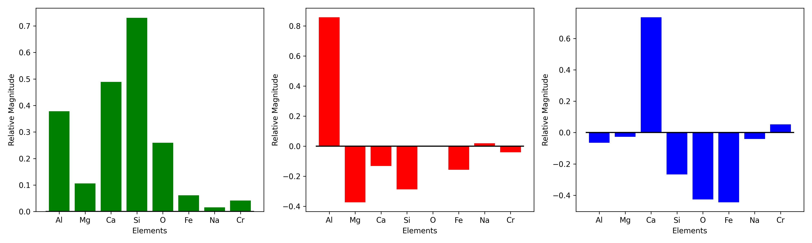

# Pre-processing Data

There may be many reasons to pre-process data, such as for cleaning or noise removal. EDS (or other hyperspectral datasets) can be loaded into python and handled using dedicated toolboxes such as HyperSpy (https://hyperspy.org/index.html), as the present software is only meant to specifically deal with the segmentation part users are recommended to make use of such tools. In order to make use of the resulting data for segmentation using GPyEDS, users need to extract the data into a numpy array as a hyperspectral cube and define a mask for the data - a binary image with 1s where data was collected and 0s where data was not collected; this ensures efficient computations for large areas with lots of empty space. 

The processing required for exported QEMSCAN data is shown in the example script!

## Vignette artifact suppresion

The only data cleaning routine present in GPyEDS tries to suppress the artifacts resulting from uneven count rates across regions of acquistions that are then tiled to form the large area scans.

Here PCA is used to remove this. The artifact is generated by effectively more counts being generated spatially systematically which is not influenced by the chemistry to the first approximation. Therefore, if prominent, it should show up as one of the principal components. This component can be suppressed to, at worst, reduce its effect.

||
|:--:|
|<b> Overview of denoising EDS K-alpha peak intensity maps from a gabbro sample using PCA.<b>|

||
|:--:|
|<b> Principal components of the variation across entire map.|
