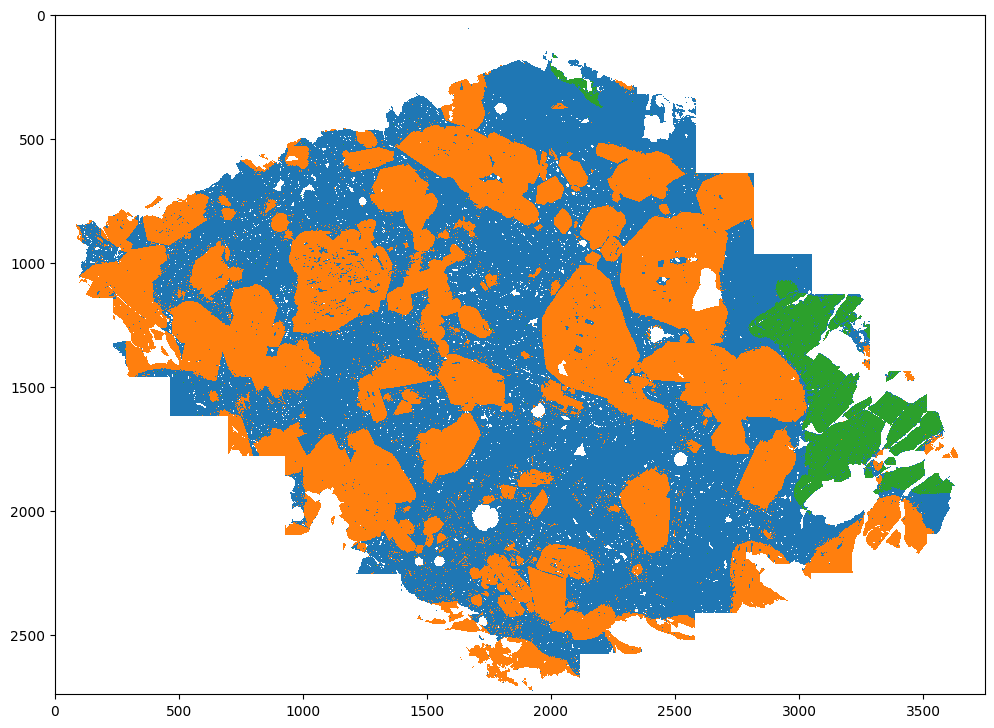
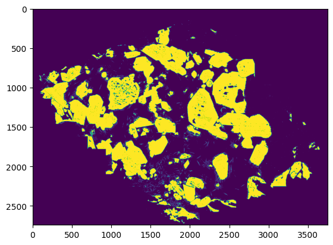
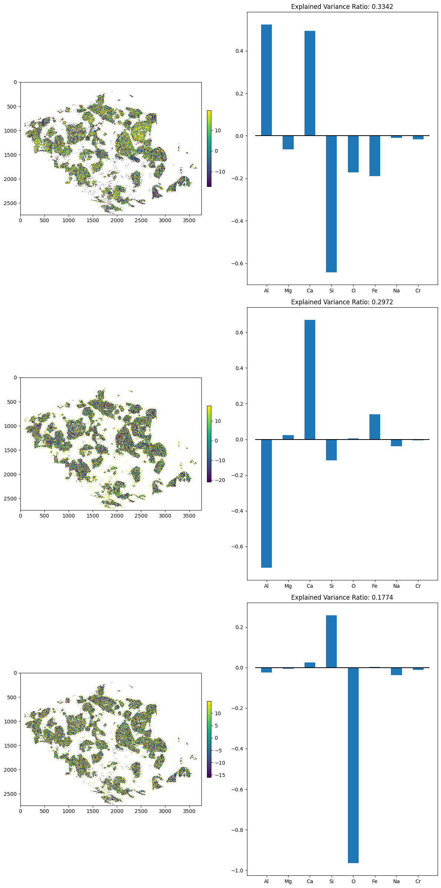
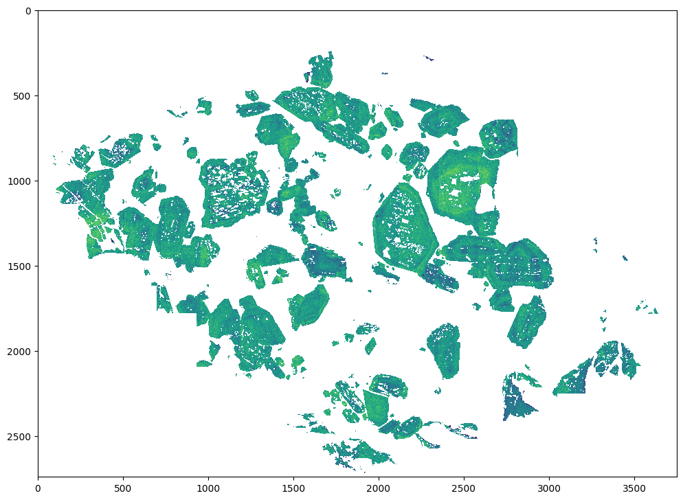

# Post-processing

Post-processing step of chemical data often involves assessing the level of zoning present within the sample. Here this is done using an automated approach through PCA (once again). Solid solution, to the first approximation, is a linear mixing between two or more endmember compositions. Therefore by assessing the linear components that explain the variance within the data should give insight into the present zoning.

This is shown with the sequence of figures here and in the example segmentation notebook.

||
|:--:|
|<b> Phase map of gabbro sample - here we take the orange phase for further processing. <b>|

||
|:--:|
|<b> Binary phase mask of orange phase. <b>|

||
|:--:|
|<b> Showing first three PCs of chemical variability in phase. <b>|

||
|:--:|
|<b> Smoothed map of PC1 showing concentric zoning of CaAl-NaSi. <b>|
