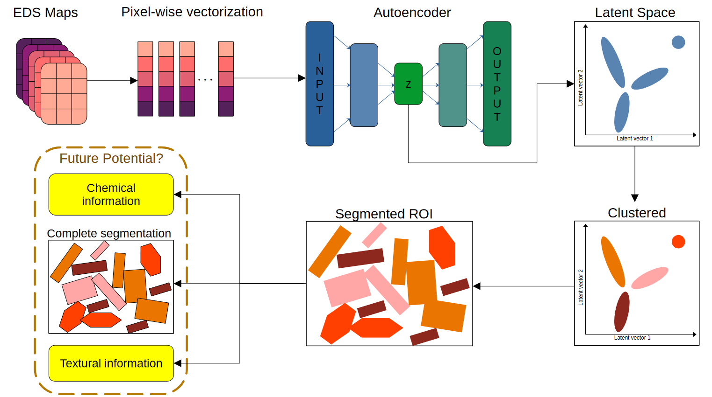

# Segmentation

See example segmentation script for more details!!

An overview of the general method is shown below - the autoencoder model can be made up of neural network layers of gaussian processes or any other trainable functions. This is largely similar in principle to the method published as SIGMA.

This can be incorporated into a large-scale and high throughput technique. Once the autoencoder is trained and latent space segmented, new datasets can be put through the encoder and clustering to generate labels directly. For this method GPs are powerful as they naturally also give the user their confidence in the encoding - ie. uncertainty in the resulting segmentation!

||
|:--:|
|<b> Segmentation overview - autoencoder can be NN or GP or anything else. <b>|
